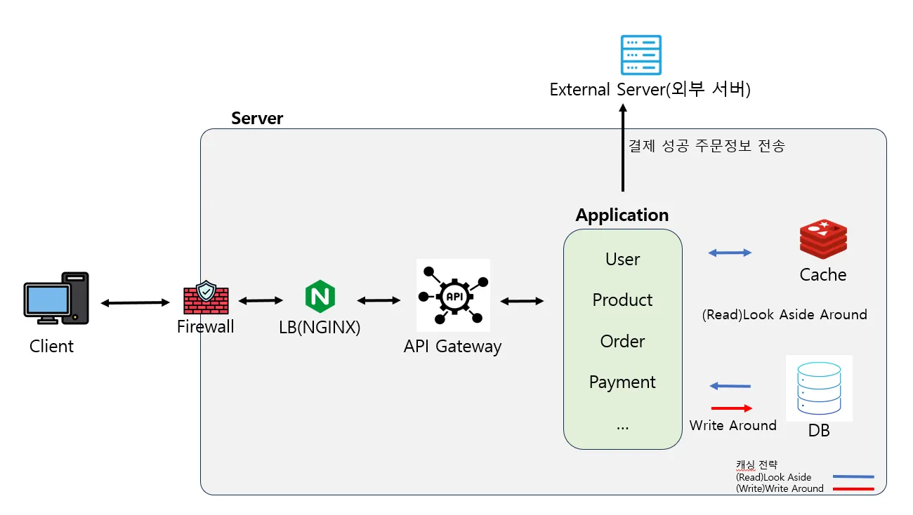

- 캐싱전략: (Read)Look Aside, (Wirte)Write Around
    - 데이터 정합성(사용자 잔액 등 일치해야 될게 많음)에 초점을 두고 Write Around로 DB에 먼저 데이터를 적재 후 Read는 유연성을 두어 캐싱 데이터를 볼 수 있도록(TTL 설정이 중요)
- GCP로 구성 예정이나 아직 파악이 덜 되어(이해가 되지 않아서..) 온프레미스 기반의 인프라 구성도 활용
- 기본적인 방화벽, LB, API GateWay 설정
